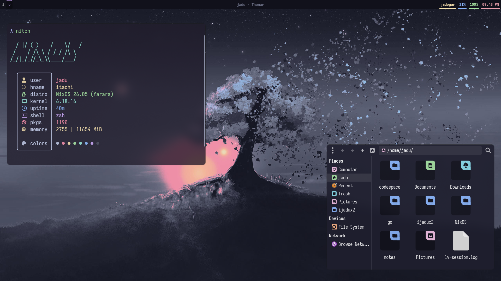

# Nixfrost

## rice



my nixos config for coding and daily usage.

## Utility used

- hyprland : for window manager
- Neovim : my terminal environmet [Sharingan.nvim](https://github.com/ijadux2/Sharingan.nvim)
- waybar : bar for hyprland
- Zsh : for shell
  - starship : for prompt
  - zoxide : better cd
- Kitty + Foot : for ternimal
- Yazi : terminal file manager
- Global theme : Catppuccin

## Installations

- cloning :

```bash
git clone https://github.com/ijadux2/Nixfrost.git ~/Nixfrost
cd ~/Nixfrost
```

> [!WARNING]
> this Nixos config is locked by git-crypt so
> remove the [Hardware-configuraton.nix](./hardware-configuration.nix) and
> [Ssh.nix](./home/modules/ssh.nix) configuration
> and adjust for your device.

- applying system config :

```bash
sudo nixos-rebuild switch --flake .#itachi
```

## Keybinds

| keys       | actions                   |
| ---------- | ------------------------- |
| mod+RETUEN | open terminal             |
| mod+B      | open browser(chromium)    |
| mod+E      | open file manager(thunar) |
